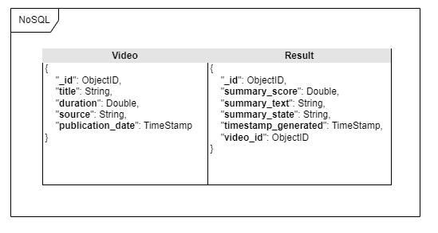

# backend-repository

## Database schema
<p align="center">
    
</p>

## Fields definition

### Video 
- _id: Unique identifier for the video,
- title: Title of the video,   
- duration: Duration of the video in seconds,
- source: URL or file path of the video,
- publication_date: Date and time when the video was published as a timestamp

### Result
- _id: Unique identifier for the result,
- summary_score: Numeric score summarizing sentiment analysis,
- summary_text: Description of sentiment analysis result,
- summary_state: Sentiment state (Positive, Negative, Neutral),
- timestamp_generated: Date and time when the result was generated as a timestamp,
- video_id: Unique identifier of the associated video

## Backend functionalities

### How it works

Script fetches video from user's chosen platform. Video is then converted to audio, divided into smaller chunks and then is uploaded to Azure SpeechToText service. Obtained responses script divides into several sections and sends it to GPT-3.5 to get the information about the video.

#### Used services
- OpenAI GPT-3.5
- Azure Speech

### Video downloading

Backend allows to download videos from several platfroms:
- Youtube
- Tiktok
- Instagram
All methods can be found in the `downloader.py` file

### Video to Audio

Due to problems with the new Youtube features (e.g. Audio track) script needs to download original videos (not only audio). 

To do this backend uses the `ffmpeg` lib and the `pydub` package.

### Audio to Text
To analyze the sound and convert it into text, script uses Azure Speech service. Because there are problems with continuous speech transmission (e.g.long pause in speech/long music - longer than 15 seconds) audio is divided into smaller, 20-second chunks.

### Text analysis
For now, full text analysis is performed by the GPT-3.5 engine. Script sends to GPT information about the video tags, name, words spoken in the intro and at the end of the video. We also limit and filter his statements.

### Requirements for Docker

- Fill `template.env` file and re-name to `.env`

- Build image:
```
docker compose build
```

- Run container:
```
docker compose up
```

- Access to container:
```
docker ps   #get container ID
docker exec -it <container-id> /bin/bash .
```

- Scripts:
All scripts are available in the `/app/functions` directory. For testing, you can run:
```
python3 example_main.py
```


### Requirements for using without Docker 
#### General:
- Fill template.env file and re-name to .env
- create venv and install packages from `requirements.txt` file

#### For Windows:
- Not yet: **TBD**

#### For Linux:
- Version: **Ubuntu 20.04** or **older** (problems with openssl lib, Azure doesn't support openssl 3.0).
- Download & Install `ffmpeg` lib:
``` 
apt-get update
apt-get install ffmpeg
```

### Credentials
Without a completed `template.env` file, script doesn't work!
```
IG_USERNAME= <instagram_username>
IG_PASSOWRD= <instagram_password>
AZURE_TOKEN= <azure_service_key>
AZURE_REGION= <azure_service_region>
OPENAI_API= <openai_api_key>
OPENAI_ORG= <openai_organization>
```

